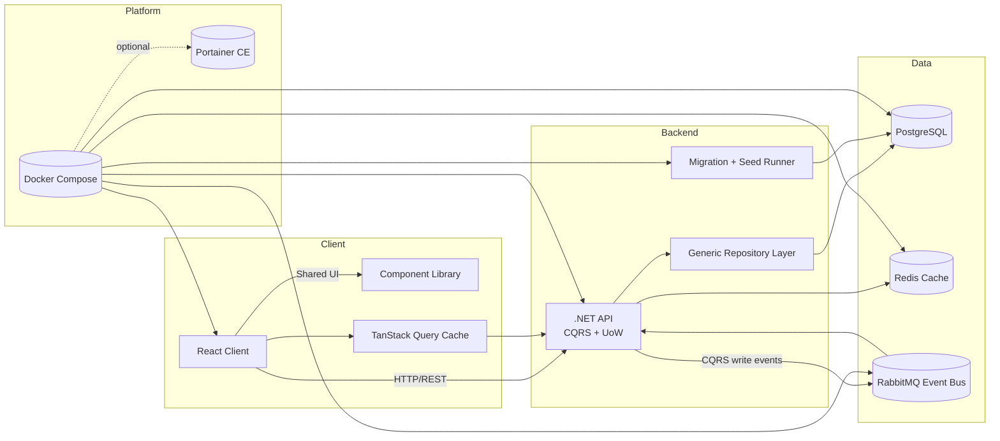

# edu-stats platform

Higher-education analytics stack built with a .NET API, a React client, shared component library, and event-driven data services orchestrated through Docker Compose.

## Architecture sketch



## Monorepo layout (planned)

- `apps/api` – ASP.NET Core solution with Domain/Application/Infrastructure layers, EF Core migrations, repository/unit-of-work implementation, and migration + seeding tooling.
- `apps/web` – React app (Vite) that consumes the API and TanStack Query for caching.
- `packages/ui` – Isolated component library shared across clients.
- `packages/testing` – Cross-cutting test utilities (mock servers, API contracts, data builders).
- `infra/` – IaC snippets, additional compose overrides, seed data, and operational runbooks.

Each project will gain its own `README.md` as features evolve, documenting decisions and commands relevant to that slice.

## Docker Compose

The provided `docker-compose.yml` wires up the shared infrastructure and placeholders for the API + client services. Highlights:

- **Postgres 16** stores the higher-education datasets and is exposed on `5432` with persistent `postgres_data` volume.
- **RabbitMQ** acts as the event bus for CQRS/event-driven workflows, with the management UI on `15672`.
- **Redis** is the distributed cache backing TanStack Query revalidation and API response caching.
- **API** service builds from `./apps/api`, exposes port `8080`, and ships a dedicated `migrator` profile that runs `dotnet ef database update` for schema management.
- **Client** service builds from `./apps/web`, exposing the dev server on `4173` and pointing at the local API host.
- **Portainer** is opt-in via the `portainer` profile so you only spin it up when you actually need a local instance.

### Usage

1. **Bootstrap infra + apps**
   ```bash
   docker compose up -d postgres rabbitmq redis
   docker compose up --build api client
   ```
2. **Apply EF Core migrations** whenever schema changes:
   ```bash
   docker compose run --rm --profile migrate migrator
   ```
3. **Launch Portainer if needed** (skip if you already have an instance on the host):
   ```bash
   docker compose --profile portainer up -d portainer
   ```
4. **Tear everything down**
   ```bash
   docker compose down
   ```

Future steps will add scripted data seeds per table, CI hooks for imperative commits, test harnesses, and documentation updates per project as they are created.
