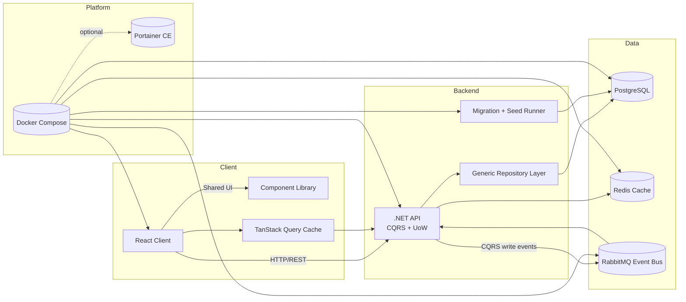

# edu-stats platform

Higher-education analytics stack built with a .NET API, a React client, shared component library, and event-driven data services orchestrated through Docker Compose.

## Architecture sketch



## Monorepo layout (planned)

- `apps/api` – ASP.NET Core solution with Domain/Application/Infrastructure layers, EF Core migrations, repository/unit-of-work implementation, and migration + seeding tooling.
- `apps/web` – React app (Vite) that consumes the API and TanStack Query for caching.
- `packages/ui` – Isolated component library shared across clients.
- `packages/testing` – Cross-cutting test utilities (mock servers, API contracts, data builders).
- `infra/` – IaC snippets, additional compose overrides, seed data, and operational runbooks.

Each project will gain its own `README.md` as features evolve, documenting decisions and commands relevant to that slice.

## Docker Compose

The provided `docker-compose.yml` wires up the shared infrastructure and placeholders for the API + client services. Highlights:

- **Postgres 16** stores the higher-education datasets and is exposed on `5432` with persistent `postgres_data` volume.
- **RabbitMQ** acts as the event bus for CQRS/event-driven workflows, with the management UI on `15672`.
- **Redis** is the distributed cache backing TanStack Query revalidation and API response caching.
- **API** service builds from `./apps/api`, exposes port `8080`, and ships a dedicated `migrator` profile that runs `dotnet ef database update` for schema management.
- **Client** service builds from `./apps/web`, exposing the dev server on `4173` and pointing at the local API host.
- **Portainer** is opt-in via the `portainer` profile so you only spin it up when you actually need a local instance.

### Usage

1. **Bootstrap infra + apps**
   ```bash
   docker compose up -d postgres rabbitmq redis
   docker compose up --build api client
   ```
2. **Apply EF Core migrations** whenever schema changes:
   ```bash
   docker compose --profile migrate run --rm migrator
   ```
3. **Launch Portainer if needed** (skip if you already have an instance on the host):
   ```bash
   docker compose --profile portainer up -d portainer
   ```
4. **Tear everything down**
   ```bash
   docker compose down
   ```

Future steps will add scripted data seeds per table, CI hooks for imperative commits, test harnesses, and documentation updates per project as they are created.

## Working agreement

- **Branches:** every feature lives on its own branch (e.g., `feat/api-scaffold`). Merge to `main` via PR after review.
- **Commits:** prefer imperative Conventional Commits (`feat: add seed runner`, `chore: align lint config`).
- **Docs:** each project folder keeps a `README.md` that documents its stage and next todos; update them whenever milestone changes.
- **Tests:** add unit tests alongside features, and wire e2e tests once the full Compose stack is usable locally.

## Backend status

- `apps/api/EduStats.sln` hosts the API stack with four projects: `EduStats.Domain`, `EduStats.Application`, `EduStats.Infrastructure`, and `EduStats.Api`.
- Clean architecture wiring includes MediatR (CQRS entrypoint), FluentValidation, and EF Core (PostgreSQL provider) with a generic repository + unit-of-work abstraction.
- The API exposes `GET /api/institutions` via `InstitutionsController`, with initial seed data delivered via EF Core migrations.
- Health probe available at `/health`; OpenAPI is published automatically in development builds.
- `apps/api/src/EduStats.Migrator` is a console utility that applies migrations + seed data (used by the Compose `migrator` profile).
- `apps/api/Dockerfile` produces multi-stage targets for the API runtime and the migrator so Compose can choose the correct artifact.

## Frontend status

- `apps/web` is a Vite + React (TS) client that uses TanStack Query, Ant Design, and shared UI primitives. `npm run dev` starts the UI on http://localhost:4173.
- `packages/ui` is a standalone component library (tsup build) plus a Vite-powered Storybook (`npm run storybook` in that folder).
- Run `npm run dev` (watch) or `npm run build` inside `packages/ui` so `dist/` stays fresh—Vite resolves `@edu-stats/ui` to that output for both dev and build flows.
- `.env.example` inside `apps/web` lists `VITE_API_BASE_URL` which defaults to `http://localhost:8080/api`.
- Playwright smoke tests (`npm run test:e2e` from repo root) verify the dashboard renders seeded institutions once the stack is up.

### Database workflow

- **Create new migrations**
  ```bash
  cd apps/api
  dotnet ef migrations add <Name> \
    --project src/EduStats.Infrastructure \
    --startup-project src/EduStats.Api \
    --output-dir Persistence/Migrations
  ```
- **Apply migrations + seed data locally**
  ```bash
  cd apps/api
  dotnet run --project src/EduStats.Migrator
  ```
- **Apply via Docker Compose**
  ```bash
  docker compose run --rm --profile migrate migrator
  ```
- API auto-migration is opt-in via `Database__RunMigrationsOnStartup=true` (already wired in `docker-compose.yml`); remove/override the env var if you prefer manual control.
